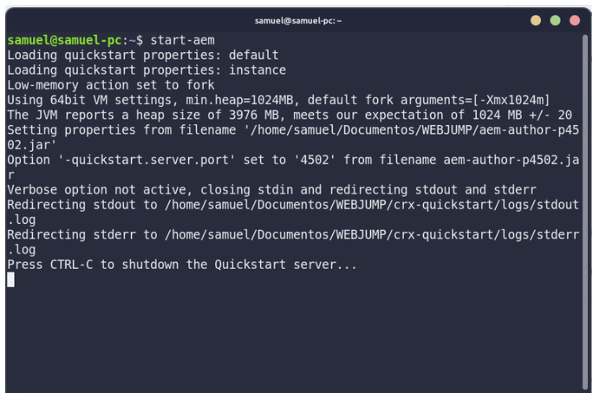
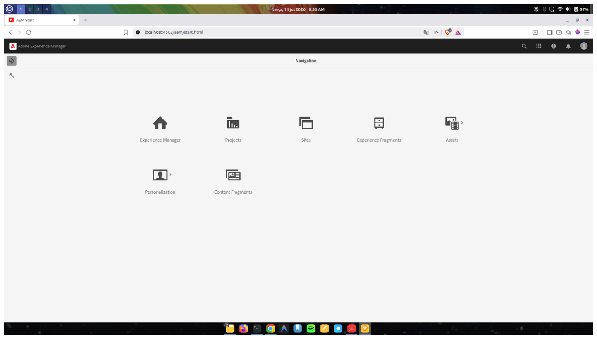
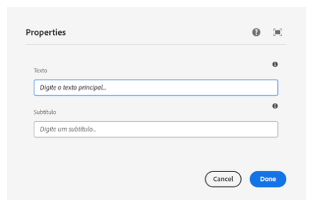
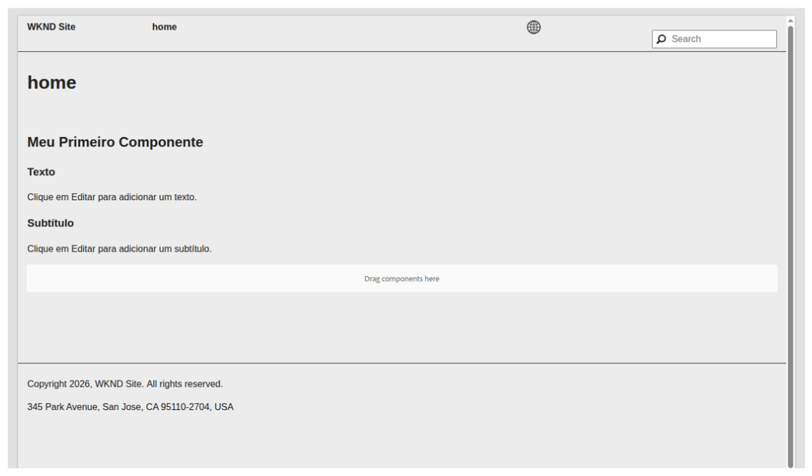
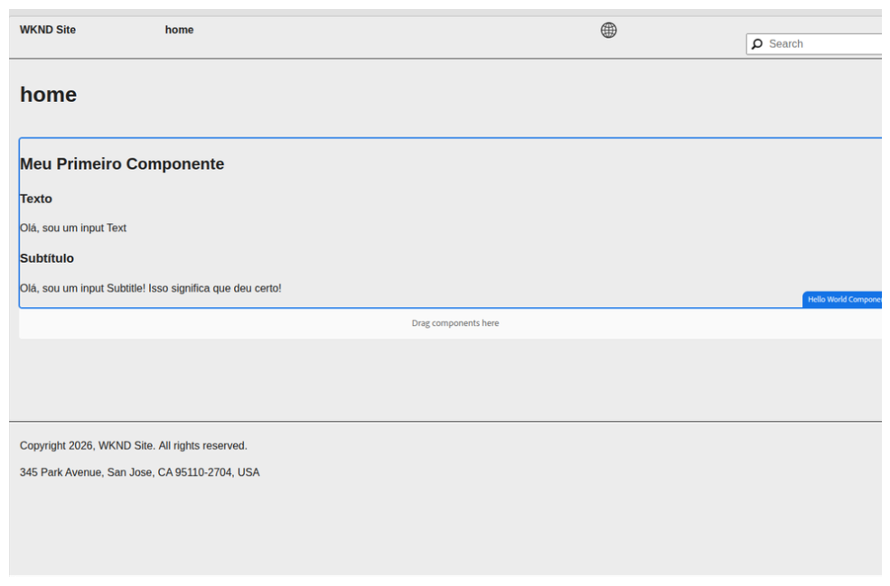

# Desafio 5.1 - Evolução do componente HelloWorld

## Sobre o desafio

Este desafio teve como objetivo evoluir o componente **HelloWorld** do projeto WKND, aplicando conceitos fundamentais do Adobe Experience Manager (AEM), como:

- HTL (HTML Template Language)
- Sling Models
- Granite UI Dialog
- Integração entre Model e HTL
- Organização da estrutura do componente
- Boas práticas de desenvolvimento

---

# Objetivos

- Criar um componente mais próximo de um cenário real de desenvolvimento.
- Melhorar a experiência do autor de conteúdo.
- Adicionar novos campos ao componente.
- Demonstrar a utilização de Sling Models para disponibilização de dados ao HTL.

---

# Funcionalidades implementadas

- ✅ Campo **Texto**
- ✅ Campo **Subtítulo**
- ✅ Integração entre Dialog e Sling Model
- ✅ Exibição dinâmica dos dados no HTL
- ✅ Mensagens padrão quando o componente ainda não foi configurado
- ✅ Estrutura HTML reorganizada
- ✅ Melhor experiência para o autor durante a edição

---

# crx rodando




# Deploy funcionando


# Estrutura do componente

```text
helloworld
│
├── .content.xml
├── helloworld.html
└── _cq_dialog
    └── .content.xml

core
└── models
    └── HelloWorldModel.java
```

---

# Fluxo de funcionamento

```text
Author

      │

      ▼

Dialog (Granite UI)

      │

      ▼

JCR Properties

      │

      ▼

HelloWorldModel

      │

      ▼

HTL

      │

      ▼

Página renderizada
```

---

# Interface do Dialog

O componente possui um diálogo para configuração do conteúdo pelo autor.

### Evidência



---

# Componente antes do preenchimento

Quando nenhum conteúdo é informado, o componente apresenta mensagens orientando o autor sobre como configurá-lo.

### Evidência



---

# Componente preenchido

Após o preenchimento dos campos, o componente renderiza as informações dinamicamente.

### Evidência



---

# Aprendizados

Durante este desafio foi possível praticar:

- criação de componentes no AEM;
- criação de Dialogs utilizando Granite UI;
- desenvolvimento de Sling Models;
- integração entre HTL e Java;
- separação entre lógica de negócio e apresentação;
- boas práticas de organização do código.

---

# Autor

Samuel Costa