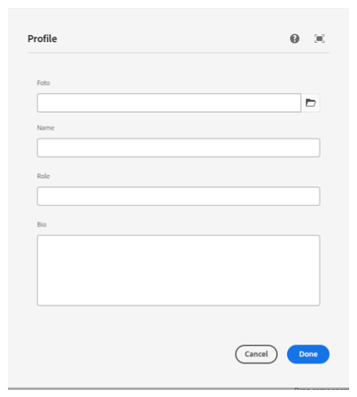
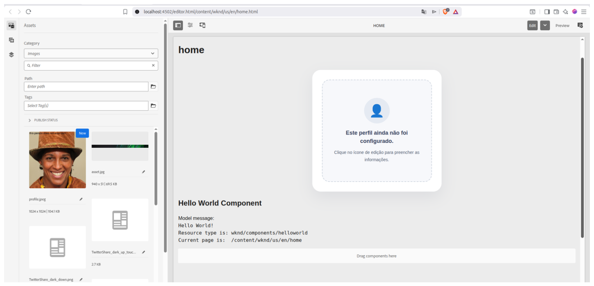
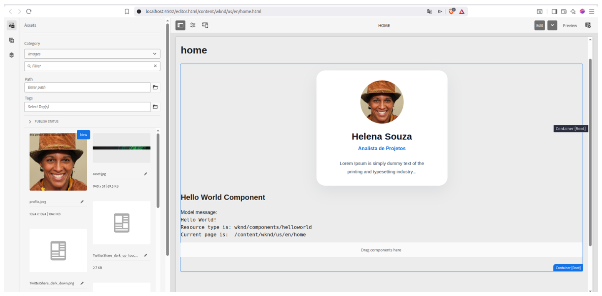
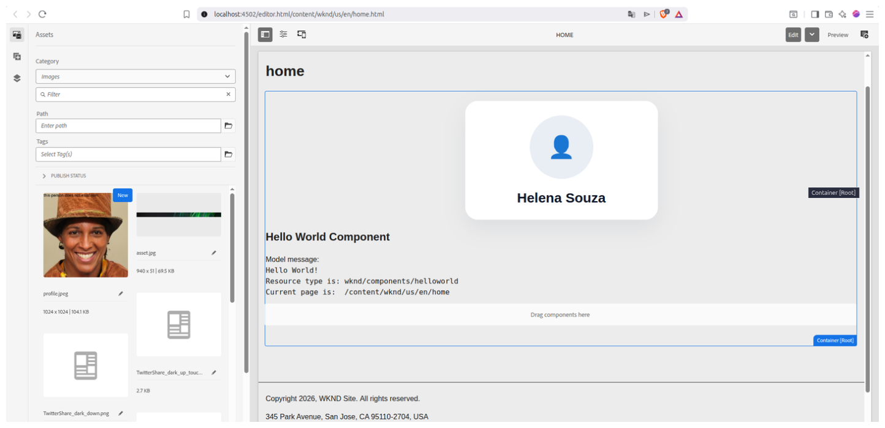
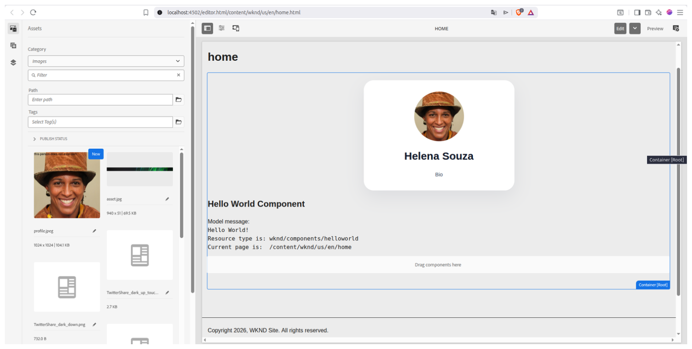

# Desafio 5.2 - Componente Profile

## Sobre o desafio

O objetivo deste desafio foi desenvolver um componente **Profile** para o projeto WKND no Adobe Experience Manager (AEM).

O componente foi desenvolvido seguindo a arquitetura do AEM, separando a camada de apresentação (HTL), a lógica de negócio (Sling Model) e a configuração do autor (Granite UI Dialog). Apliquei estilizações no Card.

---

# Objetivos

- Criar um componente reutilizável.
- Implementar um Dialog para configuração do componente.
- Desenvolver um Sling Model para disponibilização dos dados.
- Renderizar as informações utilizando HTL.
- Aplicar estilização através de Client Libraries.
- Melhorar a experiência do autor de conteúdo.

---

# Funcionalidades implementadas

- ✅ Campo para foto de perfil
- ✅ Campo para nome
- ✅ Campo para cargo
- ✅ Campo para biografia
- ✅ Placeholder quando o componente ainda não foi configurado
- ✅ Exibição condicional do cargo
- ✅ Layout em formato de card
- ✅ Estilização utilizando Client Libraries
- ✅ Organização do CSS por componente

---

# Estrutura do componente

```text
profile
│
├── .content.xml
├── profile.html
└── _cq_dialog
    └── .content.xml

core
└── models
    └── ProfileModel.java
```

---

# Fluxo de funcionamento

```text
Autor

      │

      ▼

Dialog (Granite UI)

      │

      ▼

JCR Properties

      │

      ▼

ProfileModel

      │

      ▼

HTL

      │

      ▼

Página renderizada
```

---

# Estrutura da Client Library

```text
clientlib-site
│
├── css.txt
└── css
    └── components
        └── profile.css
```

---

# Interface do Dialog

O componente mostra um diálogo para configuração de informações do perfil, sempre indicando ao usuário o deve ser feito.

Campos disponíveis:

- Foto
- Nome
- Cargo
- Biografia

### Evidência



---

# Componente sem configuração

Quando o componente ainda não foi configurado, é exibida uma mensagem orientando o autor a preencher as informações.

### Evidência



---

# Componente configurado

Após o preenchimento do diálogo, o componente renderiza um cartão contendo:

- Foto de perfil
- Nome
- Cargo (quando informado)
- Biografia

### Evidência




---

# Boas práticas aplicadas

- Separação entre lógica e apresentação.
- Utilização de Sling Models.
- Uso de HTL para renderização.
- Estrutura HTML organizada utilizando padrão BEM.
- CSS organizado por componente.
- Estilização centralizada através de Client Libraries.
- Renderização condicional utilizando `data-sly-test`.
- Interface pensada para melhorar a experiência do autor.

---

# Aprendizados

Durante o desenvolvimento deste desafio aprendi sobre:

- criação de componentes personalizados no AEM;
- criação de Dialogs utilizando Granite UI;
- desenvolvimento de Sling Models;
- renderização dinâmica utilizando HTL;
- utilização de Client Libraries para estilização;
- organização da estrutura de componentes;
- renderização condicional de conteúdo;
- boas práticas de separação entre lógica e apresentação.

---

# Melhorias implementadas

Além dos requisitos do desafio, adicionei melhorias para tornar o componente com a melhor experiência de usuário possível.
- Placeholder para componentes não configurados.
- Avatar circular.
- Layout responsivo.
- Melhor organização visual das informações.
- Estrutura preparada para manutenção futura.

---

# Autor

Samuel Costa